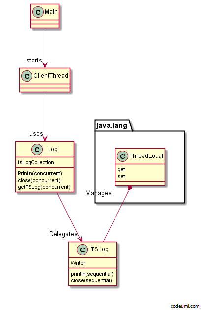

##概念##

这里是保管箱间，在这里，有许多投币保管箱都排在一起，有个人拿着自己的要是进来了保管箱间，
当他退出的时候，手上拿着自己的行李。又有一个人拿着自己的钥匙进来了，虽然进到同一个保管箱间，但一定是打开
自己的保管箱。每个用户，都会从各自的保管箱中拿出自己的行李。

Thread-Specific Storage Pattern是只有一个入口，但内部会对每个线程提供特有
存储空间的Pattern。

使用java标准链接库时，可以用java.lang.ThreadLocal类加以实现。


##范例程序1：没有使用Thread-Specific Storage Pattern##


- Log.java

```java
import java.io.PrintWriter;
import java.io.FileWriter;
import java.io.IOException;

public class Log {
    private static PrintWriter writer = null;

    // 初始化Writer字段
    static {
        try {
            writer = new PrintWriter(new FileWriter("log.txt"));
        } catch (IOException e) {
            e.printStackTrace();
        }
    }

    // 加入一条log
    public static void println(String s) {
        writer.println(s);
    }

    // 关闭log
    public static void close() {
        writer.println("==== End of log ====");
        writer.close();
    }
}

```


- Main.java

```java
public class Main {
    public static void main(String[] args) {
        System.out.println("BEGIN");
        for (int i = 0; i < 10; i++) {
            Log.println("main: i = " + i);
            try {
                Thread.sleep(100);
            } catch (InterruptedException e) {
            }
        }
        Log.close();
        System.out.println("END");
    }
}

```

##范例程序2：使用Thread-Specific Storage Pattern##




- TSLog.java

```java

import java.io.PrintWriter;
import java.io.FileWriter;
import java.io.IOException;

public class TSLog {
    private PrintWriter writer = null;

    // 初始化writer字段
    public TSLog(String filename) {
        try {
            writer = new PrintWriter(new FileWriter(filename));
        } catch (IOException e) {
            e.printStackTrace();
        }
    }

    // 加入一条log
    public void println(String s) {
        writer.println(s);
    }

    // 关闭log
    public void close() {
        writer.println("==== End of log ====");
        writer.close();
    }
}

```

- Log.java

对外公开的方法都一样，可是实现却相差很多

```java
public class Log {
    private static final ThreadLocal<TSLog> tsLogCollection = new ThreadLocal<TSLog>();

    // 加入一条log
    public static void println(String s) {
        getTSLog().println(s);
    }

    // 关闭log
    public static void close() {
        getTSLog().close();
    }

    // 取得线程特有的log
    private static TSLog getTSLog() {
        TSLog tsLog = tsLogCollection.get();

        // 如果线程是第一次调用，就建立新文件并注册log
        if (tsLog == null) {
            tsLog = new TSLog(Thread.currentThread().getName() + "-log.txt");
            tsLogCollection.set(tsLog);
        }

        return tsLog;
    }
}

```

- ClientThread.java

```java
public class ClientThread extends Thread {
    public ClientThread(String name) {
        super(name);
    }
    public void run() {
        System.out.println(getName() + " BEGIN");
        for (int i = 0; i < 10; i++) {
            Log.println("i = " + i);
            try {
                Thread.sleep(100);
            } catch (InterruptedException e) {
            }
        }
        Log.close();
        System.out.println(getName() + " END");
    }
}

```

- Main.java

```java
public class Main {
    public static void main(String[] args) {
        new ClientThread("Alice").start();
        new ClientThread("Bobby").start();
        new ClientThread("Chris").start();
    }
}

```

##Thread-Specific Storage Pattern 的所有参与者##

- Client(委托人)参与者：ClientThread类
- TSObjectProxy（线程独有对象的代理者）参与者：Log类
- TSObjectCollection（线程独有对象的集合）参与者：java.lang.ThreadLocal类
- TSObject（线程独有的对象）参与者：TSLog类

##知识点##

- 局部变量与java.lang.ThreadLocal类的区别

线程本来就有其特有的区域，就是存放方法局部变量的堆栈。在方法里分配的局部变量，
都是线程所独有，无法由其他线程访问。
但是，这些变量一退出方法就会消失。
而ThreadLocal则是与方法调用无关，为线程分配特有空间的类。

补充说明：虽然局部变量无法由其他线程访问，但局部变量所存放的实例，就可能由
其他线程访问了。因为这个实例可能是以方法参数的形式，从外面传进来的：

```java
void method(Object givenobj){
	Object var1 = givenobj;
	Object var2 = new Object;
	......
}
```

这是，局部变量var1,var2，都不可能被调用method方法以外的线程访问。
但是,var1所存放的givenobj就有可能被其他线程所访问了。（也就是说无法保证局部变量的内部状态不发生改变）

- 放置线程特有信息的地方
 - 线程外:thread-external

例如：所有TSLog的实例都存放在Log类所拥有的java.lang.ThreadLocal的实例里
 
 - 线程内：thread-internal

例如：建议一个Thread类的子类MyThread，我们声明MyThread的字段，就是线程特有的信息放在线程内


总结： 将特有信息存放在线程外的方式，就像是自己所有，但没有带在身上；
而将特有信息存放在线程内的方式，就像是拿在自己手上一样。

- 不必担心被其他线程访问

多个线程所共享的是Log类，实际的工作则是在将TSLog类分配给线程以后进行。
也就是说使用Log类来分配不该被共享的TSLog类。

- Throughput的提升取决于实现

有人会认为使用Single Threaded Execution Pattern比此模式的Throughput来的高。这并不是绝对的：

互斥控制可能会隐藏在java.lang.ThreadLocalzhong里。
另外通过Log 调用方法时，每次都要从ThreadLocal取得TSLog，也要花一些时间。

使用Thread-Specific Storage Pattern，与其将着眼点放在throughput上，更重要的是程序的复用性：

1. 不需要改编程序的结构
范例1-->范例2的所需要的操作


2. 共享互斥不在表面上出现，可避免犯错。
避免自己实现Single Threaded Execution Pattern时忘记加synchronized
或是实现Guarded Suspension Pattern时，写错警戒条件等等。比避免程序出现死锁的危险性。


##缺点##
- 隐藏context的危险性

context的概念，在计算机绘图处理是常常用到。与计算机绘图有挂你的链接库提供的方法，
通常自变量都有数量较多的倾向。这是因为光要画出一条线，就需要坐标值、坐标系、单位、颜色、线段粗细、画笔类型等，
非常多的信息。为了设法减少自变量的量，就会定义graphics context或是device context等数据结构。（学习Swing或者Android的时候经常会用到）
而对链接库指示“现在调用的方法，都请在这个context来处理”。context可使程序结构简单化。可是相对的，
可能带来识别程序使用到的信息变得暧昧模糊的危险性。context的危险性，跟全局变量差不多


当我们要寻找bug发生的原因时，会紧盯信息的流程追踪。
例如为了检查传递给方法的数据是否正常时，就会尝试将参数的值进行合法性判断并输出显示出来。
但是，如果使用了context，解决起来就困难多了。因为程序以前的行为，也有可能会是context出现异常，
而是造成现在的bug的真正原因。

##进阶说明## 

- Actor-based的思维

用一句话说，就是“偏重于线程”的开发方式

Actor-based开发方式中，代表线程的实例，会拥有进行工作所需的信息（context、状态）
这样一来，可降低线程之间需要传递的信息。每个线程会使用其他线程所传来的信息进行处理，改变自己的
内部状态。这种线程通常称为actor（操作者）

我们可建立Thread类的子类，并定义自己的字段，将工作相关的信息都放入字段中。这就是建立“小型的actor”

Actor长的大概像是这样：

```java

class Actor extends Thread{
	//操作者的内部状态
	public void run(){
	//从外部取得任务，改变自己内部状态的循环
	}
}

```

- Task-based的思维

Task-based，用一句话说，就是“偏重于工作”的开发方式

Task-based的开发方式，就是不将信息（context、状态）放到线程里。而是把信息
放在线程之间所传递的实例里。并不是只有数据，包括用来执行工作的方法，也放在这个实例里。
这种线程间传递的实例称为“消息”、“请求”或“命令”。在这里我们又称它为Task（任务）。任务内含有
足够的信息，所以任务可以由任何线程来进行。这个开发方式，可使巨大的任务能在轻巧的线程之间往来。

这种开发方式最典型的就是Worker Thread Pattern

我们可以将工作需要的信息，定义在implements Runnable的类型里，再定义run方法，使它能够交由
线程执行。这就建立出“小型的task”了。将建立出的任务交给线程后，工作就能够执行了。
```java
class Task implements Runnable{
	//执行任务所需的信息
	public void run(){
	//执行任务所需处理的内容
	}
}
```

补充说明：java.util.Timer类与java.util.TimerTask类的区别

java.util.TimerTask就是一个Task-based的类。
这个类实现的java.lang.Runnable接口，可由java.util.Timer类调用。
java.util.TimerTask中可以记载在一定时候要做的事，或是定期要执行的操作。


- 实际上两个开发方式是混用的

这里所说的Actor-based 与Task-based两种开发方式，也不是完全分离的。即使是在一个程序里，
两者也可能各占一定比例。
一般来说，会是“task在一群acotr之间传递”的状况。
另外，Actor-based与Task-based的分类，是Doug Lea所提出来的。- 隐藏context的危险性

context的概念，在计算机绘图处理是常常用到。与计算机绘图有挂你的链接库提供的方法，
通常自变量都有数量较多的倾向。这是因为光要画出一条线，就需要坐标值、坐标系、单位、颜色、线段粗细、画笔类型等，
非常多的信息。为了设法减少自变量的量，就会定义graphics context或是device context等数据结构。（学习Swing或者Android的时候经常会用到）
而对链接库指示“现在调用的方法，都请在这个context来处理”。context可使程序结构简单化。可是相对的，
可能带来识别程序使用到的信息变得暧昧模糊的危险性。context的危险性，跟全局变量差不多


当我们要寻找bug发生的原因时，会紧盯信息的流程追踪。
例如为了检查传递给方法的数据是否正常时，就会尝试将参数的值进行合法性判断并输出显示出来。
但是，如果使用了context，解决起来就困难多了。因为程序以前的行为，也有可能会是context出现异常，
而是造成现在的bug的真正原因。


- java.lang.ThreadLocal类的安装

ThreadLocal类是支持多线程的环境（Thread Safe）的类，但并不一定要用synchronized
来进行共享互斥。是否用synchronized进行共享互斥，要视类库而定


##练习问题##

- TSLog类和Log类的println方法与close方法不需要synchronized的理由

TSLog类的println方法和close方法不会被一个以上的线程调用。
TSLog的实例会被ThreadLocal类管理，并且当成线程的固有数据来处理。这样的话，
某个线程使用的TSLog的实例就会固定了。一个线程无法使用应支持其他线程的TSLog的实例

Log类的println方法和close方法会被一个以上的线程调用。但是，Log类并没有应该要保护的部分。
因此，没有必要设为synchronized


- 线程的终止处理，线程在结束时，就会自己关闭掉log文件

ClientThread.java

```java

public class ClientThread extends Thread {
    public ClientThread(String name) {
        super(name);
    }
    public void run() {
        System.out.println(getName() + " BEGIN");
        for (int i = 0; i < 10; i++) {
            Log.println("i = " + i);
            try {
                Thread.sleep(100);
            } catch (InterruptedException e) {
            }
        }
        // Log.close() 已经不需要Log.close()
        System.out.println(getName() + " END");
    }
}
```

Log.java

```java

public class Log {
    private static final ThreadLocal<TSLog> tsLogCollection = new ThreadLocal<TSLog>();

    // 写log
    public static void println(String s) {
        getTSLog().println(s);
    }

    // 关闭log
    public static void close() {
        getTSLog().close();
    }

    // 获得线程固有的log
    private static TSLog getTSLog() {
        TSLog tsLog = tsLogCollection.get();

        // 如果该线程是第一次调用，就重建注册
        if (tsLog == null) {
            tsLog = new TSLog(Thread.currentThread().getName() + "-log.txt");
            tsLogCollection.set(tsLog);
            startWatcher(tsLog);
        }

        return tsLog;
    }

    // 启动等待线程结束的线程
    private static void startWatcher(final TSLog tsLog) {
        // 被监视的线程
        final Thread target = Thread.currentThread();
        // 进行监视的线程
        final Thread watcher = new Thread() {
            public void run() {
                System.out.println("startWatcher for " + target.getName() + " BEGIN");
                try {
                    target.join();
                } catch (InterruptedException e) {
                }
                tsLog.close();
                System.out.println("startWatcher for " + target.getName() + " END");
            }
        };
        // 开始监视
        watcher.start();
    }
}

```

- 希望把构造器被调用的操作记录在log文件里

然而实际执行时却发现Alice-log.txt、Bobby-log.txt、Chris-log.txt的内容没有出现
“contructor is called” 字符串，为什么？

```java
public class ClientThread extends Thread {
    public ClientThread(String name) {
        super(name);
        //这一行为什么没有输出
        Log.println("constructor is called.");
    }
    public void run() {
        System.out.println(getName() + " BEGIN");
        for (int i = 0; i < 10; i++) {
            Log.println("i = " + i);
            try {
                Thread.sleep(100);
            } catch (InterruptedException e) {
            }
        }
        Log.close();
        System.out.println(getName() + " END");
    }
}

```

因为正在执行构造器的线程是主线程
正在执行ClientThread的run方法的线程，是由主线程启动的新线程，与主线程不同。

执行题目中的程序，就会建立出main-log.txt的文件。但是，主线程并没有调用close
，因此，很有可能“contructor is called”这个字符串并没有被保存下来。


- 请举例说明java.lang.Thread在线程内（thread-internal）所拥有的线程特色的信息

 - 线程的名称：Thread.currentThread.getName()来取得
 - 线程的优先级：getPriority
 - 线程组：getThreadGroup
 - 中断的状况：isInterrupted
 - 是否为Daemon线程：isDaemon
 - 是否或者：isAlive