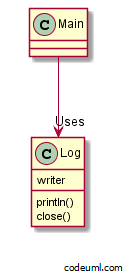

##概念##

这里是保管箱间，在这里，有许多投币保管箱都排在一起，有个人拿着自己的要是进来了保管箱间，
当他退出的时候，手上拿着自己的行李。又有一个人拿着自己的钥匙进来了，虽然进到同一个保管箱间，但一定是打开
自己的保管箱。每个用户，都会从各自的保管箱中拿出自己的行李。

Thread-Specific Storage Pattern是只有一个入口，但内部会对每个线程提供特有
存储空间的Pattern。

使用java标准链接库时，可以用java.lang.ThreadLocal类加以实现。


##范例程序1：没有使用Thread-Specific Storage Pattern##




- Log.java

```java
import java.io.PrintWriter;
import java.io.FileWriter;
import java.io.IOException;

public class Log {
    private static PrintWriter writer = null;

    // 初始化Writer字段
    static {
        try {
            writer = new PrintWriter(new FileWriter("log.txt"));
        } catch (IOException e) {
            e.printStackTrace();
        }
    }

    // 加入一条log
    public static void println(String s) {
        writer.println(s);
    }

    // 关闭log
    public static void close() {
        writer.println("==== End of log ====");
        writer.close();
    }
}

```


- Main.java

```java
public class Main {
    public static void main(String[] args) {
        System.out.println("BEGIN");
        for (int i = 0; i < 10; i++) {
            Log.println("main: i = " + i);
            try {
                Thread.sleep(100);
            } catch (InterruptedException e) {
            }
        }
        Log.close();
        System.out.println("END");
    }
}

```

##范例程序2：使用Thread-Specific Storage Pattern##


##适用性##


##缺点##


##知识点##


##练习问题##