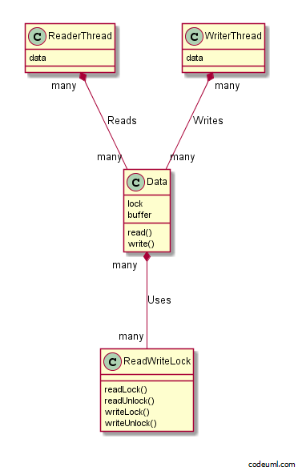

##概念##

Read-Write Lock Pattern 将读取与写入分开来处理。在读取数据之前，必须获取用来读取的锁定。而要写入的时候，则必须获取用来写入的锁定。

因为进行读取时，实例的状态不会改变，所以，就算有多个线程在同时读取也没关系。但，有人在读取的时候，不可以做写入的操作。
写入的时候，实例的状态机会改变。于是，当有一个线程在写入的时候，其他线程就不可以有进行读取或写入。

一般来说，进行共享互斥会使程序性能变差，但将写入的共享互斥与读取的共享互斥分开来思考，就可以提升程序的性能。


##范例##




- Main.java

```java
public class Main {
    public static void main(String[] args) {
        Data data = new Data(10);
        new ReaderThread(data).start();
        new ReaderThread(data).start();
        new ReaderThread(data).start();
        new ReaderThread(data).start();
        new ReaderThread(data).start();
        new ReaderThread(data).start();
        new WriterThread(data, "ABCDEFGHIJKLMNOPQTSTUVWXYZ").start();
        new WriterThread(data, "abcdefghijklmnopqrstuvwxyz").start();
    }
}

```

- Data.java

```java
public class Data {
    private final char[] buffer;
    //这个是该Pattern的主角——ReadWriteLock的实例
    private final ReadWriteLock lock = new ReadWriteLock();
    public Data(int size) {
        this.buffer = new char[size];
        for (int i = 0; i < buffer.length; i++) {
            buffer[i] = '*';
        }
    }
    public char[] read() throws InterruptedException {
        lock.readLock();
        try {
            return doRead();
        } finally {
            lock.readUnlock();
        }
    }
    public void write(char c) throws InterruptedException {
        lock.writeLock();
        try {
            doWrite(c);
        } finally {
            lock.writeUnlock();
        }
    }
    private char[] doRead() {
        char[] newbuf = new char[buffer.length];
        for (int i = 0; i < buffer.length; i++) {
            newbuf[i] = buffer[i];
        }
        slowly();
        return newbuf;
    }
    private void doWrite(char c) {
        for (int i = 0; i < buffer.length; i++) {
            buffer[i] = c;
            //模拟需要花点时间的工作
            //之所以放在循环里面是因为嘉定写入所化的时间会比读取来得长
            slowly();
        }
    }
    private void slowly() {
        try {
            Thread.sleep(50);
        } catch (InterruptedException e) {
        }
    }
}

```

- WriterThread.java

```java
import java.util.Random;

public class WriterThread extends Thread {
    private static final Random random = new Random();
    private final Data data;
    private final String filler;
    private int index = 0;
    public WriterThread(Data data, String filler) {
        this.data = data;
        this.filler = filler;
    }
    public void run() {
        try {
            while (true) {
                char c = nextchar();
                data.write(c);
                Thread.sleep(random.nextInt(3000));
            }
        } catch (InterruptedException e) {
        }
    }
    private char nextchar() {
        char c = filler.charAt(index);
        index++;
        if (index >= filler.length()) {
            index = 0;
        }
        return c;
    }
}

```

- ReaderThread.java

```java
public class ReaderThread extends Thread {
    private final Data data;
    public ReaderThread(Data data) {
        this.data = data;
    }
    public void run() {
        try {
            while (true) {
                char[] readbuf = data.read();
                System.out.println(Thread.currentThread().getName() + " reads " + String.valueOf(readbuf));
            }
        } catch (InterruptedException e) {
        }
    }
}

```

- ReadWriteLock.java

为了保护安全性，我们必须防止下面两种冲突：

 - 	“读取”和“写入”的冲突（read-write conflict）

已经有线程在进行写入时，等待。理由：不等待的话，会引起read-write conflict
已经有线程进行读取时，等待。理由：不等待的话，会引起read-write conflict
 
 -  “写入”和“写入”的冲突（write-write conflict）

已经有线程在进行写入时，等待。理由：不等待的话，会引起write-write conflict

已经有线程在进行写入时，等待。理由：不等待的话，会引起read-write conflict

 已经有线程进行读取时，不等待，理由：read-read不会造成conflict

- 整理成表格


|    空      | 读取           | 写入  |
| ------------- |:-------------:| -----:|
| 读取     | 不会冲突 | “读取”和“写入”的冲突（read-write conflict） |
| 写入     | “读取”和“写入”的冲突（read-write conflict）     |  “写入”和“写入”的冲突（write-write conflict） |


```java
public final class ReadWriteLock {
    private int readingReaders = 0; // (A) 实际正在读取的线程数量
    private int waitingWriters = 0; // (B) 正在等待写入的线程数量
    private int writingWriters = 0; // (C) 实际正在写入的线程数量，字段的知不是0就是1，绝不会是2以上（一瞬间都不会）  
    private boolean preferWriter = true; // 写入优先的话，值为true。这是为了使线程的生命性不会降低所做的功劳。
    
    public synchronized void readLock() throws InterruptedException {
    	//使用了 Guarded Suspension Pattern,警戒条件是“没有线程正在执行写入的操作”，注意这里有其他线程读取并不会造成影响，但绝不能有线程正在执行写入的操作。
        while (writingWriters > 0 || (preferWriter && waitingWriters > 0)) {
            wait();
        }
        readingReaders++;                       // (A) 实际正在读取的线程数量加1
    }

    public synchronized void readUnlock() {
        readingReaders--;                       // (A) 实际正在读取的线程数量减1
        preferWriter = true;
        notifyAll();
    }

    public synchronized void writeLock() throws InterruptedException {
        waitingWriters++;                       // (B) 正在等待写入的线程数量加1
        try {
        //使用Guarded Suspension Pattern,警戒条件是“没有线程进行读取或写入的操作”
            while (readingReaders > 0 || writingWriters > 0) {
                wait();
            }
        } finally {
            waitingWriters--;                   // (B) 正在等待写入的线程数量减1
        }
        writingWriters++;                       // (C) 实际正在写入的线程加1
    }

    public synchronized void writeUnlock() {
        writingWriters--;                       // (C) 实际正在写入的线程减1
        preferWriter = false;
        notifyAll();
    }
}

```

##Read-Write Lock Pattern##

- Reader（读取者）参与者：ReadThread
- Writer（写入者）参与者：WriterThread
- SharedResource（共享资源）参与者：Data类
- ReadWriter（读写用锁定）参与者：ReadWriteLock

##适用性##

- 利用同时“读取”不会冲突的特性，提高程序的性能


- 适合读取操作繁重时


- 适合读取比写入次数繁重时

不过当写入的操作频率较高时，Writer参与者会经常阻挡Read参与者的进行，这样无法展现Read-Write Lock Pattern 的优点（可以兼顾SharedResource参与者的安全性，也能使程序的性能提高。尤其是当read操作繁重时，可使程序性能大幅地上升）。


##知识点##

- 在read方法的try块中执行了return语句，就连这种情况下，从方法退出之前，finally的内容还是会被执行，可以在这里避免忘记解除锁定。

- doRead方法里，使用for语句来拷贝数组的内容，这是为了方法拿到与doWrite作比较。要拷贝数组的内容时，使用java.lang.System.arraycopy方法是比较普通的方式。

- 这一章的“读访问锁定”、“写入用锁定”这些“锁定”，与使用synchronized获取的锁定意义上并不同。这不是Java语言制订的机制，而是程序员自己实现的。这就是所谓的逻辑上的锁定。

在ReadWriteLock类中，提供了“读访问锁定”、“写入用锁定”等两种逻辑上的锁定。但是示例做这两种逻辑上的锁定，其实只是用到来了一个物理性的锁定。这个物理性的锁定，就是ReadWriteLock实例的锁定。


- Before/After Pattern的架构需要注意的地方

在此，before 在try之外，表示“如果在before的执行过程中发生异常，就不执行execute与after”。例如，从before 中抛出InterruptedException，就可以想成是“before 的执行过程中断”。
如果before 放在try这段程序代码块中，即使中断before的执行，也会调用处after。


- preferWriter字段的作用，如果去掉会怎么样

ReadThread的线程与WriteThread线程的数目哪个多，就会一直输出该日志。

即使有一个ReadThread在进行doRead，WriteThread也会无法执行doWrite。
但是ReadThread不会被设置为共享互斥，因此会一个个执行doRead。到最后，WriteThread就越来越无法执行doWrite。
这就好像马路上的车子川流不息，而无法穿越马路的意思是一样的。

范例中的ReadWriteLock类的waitingWriter字段会保持wait中的WriteThread的数目。当waitingWrite > 0成立时，
通过让ReadThread的线程wait，就可以避免WriteThread无法开始执行的情况。这就像当有人等待过马路时，红绿灯自己就变成红灯让车辆停下来，行人可以安全通过一样。

但是，光是考虑waitWriters的情况的话，下次可能变成ReadThread无法开始执行doRead。那种情况就是1个WriterThread在结束执行doWrite之前，其他的WriterThread
已经到达了Write。只要有一个WriterThread正在wait，ReaderThread就无法开始执行doRead，因此到最后，ReaderThread就无法开始执行doRead。这就好像一直有人要过马路，
自按式交通信号灯一直有人按着，两旁的车子就一直等待红灯而无法前进一样。

范例程序的ReadWriteLock类的preferWriter字段是决定ReaderThread和WriterThread何者优先的标识（Flag）。preferWriter只要是true，就开始要考虑Guard条件的waitingWriters。
然后，在readUnlock中（也就是doRead结束时）将preferWriter设置为true。
结果，read处理结束后优先write处理，在write处理结束后就优先优先处理read。preferWriter字段就是用来让ReaderThread和WriterThread轮流优先执行的。
这就好比行人的信号量灯与行车的信号量灯轮流变成红灯时一样的。


##练习问题##

- 如果用synchronized替代ReadWriteLock，会怎么样？

 ReaderThread的线程在执行20次read的调用的前后，取得现在的时间。
 使用ReadWriteLock类的话，只要大约两秒执行就可以结束。
 但是使用synchronized却要大约9~10秒的时间。这些值会受到doRead或doWrite所花的时间，以及ReaderThread与WriteThread的个数所影响而变动。此外，跟Java执行处理系统的安装也有关，这点请注意。

- 上述范例有何缺点，该如何改进？

 - Data类包含了实例进行读写的操作，若要进行其他的读写操作，需要建立新的类，进行与Data类一样的同步处理操作。
 - ReadWriteLock类包含了警戒条件。当想要更改警戒条件的原则时，还需要建立新的类，进行与Data类一样的读写操作。
 - ReadWriteLock类的方法都是public，有被Data以外的类调用的危险。


以下只是方法之一。例如，在Doug Lea的util.concurrent包中，使用Template Method Pattern以提高重复使用性。
参考[Overview of package util.concurrent Release 1.3.4.](http://gee.cs.oswego.edu/dl/classes/EDU/oswego/cs/dl/util/concurrent/intro.html) 中的 WriterPreferenceReadWriteLock类，以及其他的解释。


为了解决建立新类的问题，我们使用GoF的Strategy Pattern

关于读写处理的policy，我们以ReadWriteStrategy表示，
Guard条件相关policy则以GuardStrategy接口表示。
之后，在建立Data类的实例时，设置表示各自policy的ConcreteStrategy参与者，在执行时将处理交给对方处理。
如果policy未被设置，则默认的policy ，如DefaultReadWriteStrategy类、DefaultReadWriteStrategy类会成为Data类的内部类（inner class）.

以下是程序：


- GuardStrategy.java

```java
package readwirtelock;

public interface GuardStrategy{
	public abstract void beforeReadWait();
	public abstract boolean readGuard();
	public abstract void afterReadWait();
	public abstract void beforeDoRead();
	public abstract void afterDoRead();


	public abstract void beforeWriteWait();
	public abstract boolean writeGuard();
	public abstract void afterWriteWait();
	public abstract void beforeDoWrite();
	public abstract void afterDoWrite();

}

```


- ReadWriteStrategy.java

```java

package readwritelock;

public interface ReadWriteStrategy{
	public abstract Object doRead() throws InterruptedException;
	public abstract void doWrite(Object arg) throws InterruptedException;
	
}

```

- Data.java

```java
package readwritelock;

public class Data{
	private final ReadWriteLock lock;
	private final ReadWriteStrategy readWriteStrategy;

	//使用默认读写策略
	public Data(){
		this.lock = new ReadWriteLock(new DefaultReadWriteStrategy());
		this.readWriteStrategy = new DefaultReadWriteStrategy();
	}

	//使用防卫式策略
	public Data(GuardStrategy guardStrategy){
		this.lock = new ReadWriteLock(guardStrategy);
		this.readWriteStrategy = new DefaultReadWriteStrategy();
	}

	//使用读写式策略
	public Data(ReadWriteStrategy readWriteStrategy){
		this.lock = new ReadWriteLock(new DefaultReadWriteStrategy());
		this.readWriteStrategy = readWriteStrategy;
	}

	//防卫式策略+读写式策略一起用
	public Data(GuardStrategy guardStrategy,ReadWriteStrategy readWriteStrategy){
		this.lock = new ReadWriteLock(guardStrategy);
		this.readWriteStrategy = readWriteStrategy;
	}

	public Object read throws InterruptedException{
		lock.readLock();
		try{
			return readWriteStrategy.doRead();
		}finally{
			lock.readUnlock();
		}
	}

	public void write(Object arg) throws InterruptedException{
		lock.writeLock();
		try{
			readWriteStrategy.doWrite(arg);
		}finally{
			lock.writeUnlock();
		}
	}

	//内部类
	private class ReadWriteLock{
		private final GuardStrategy guardStrategy;
		public ReadWriteLock(GuardStrategy guardStrategy){
			this.guardStrategy = guardStrategy;
		}

		public synchronized void readLock() throws InterruptedException{
			guardStrategy.beforeReadWait();
			try{
				while(!guardStrategy.readGuard()){
					wait();
				}
			}finally{
				guardStrategy.afterReadWait();
			}

			guardStrategy.beforeDoRead();
		}

		public synchronized void readUnlock(){
			guardStrategy.afterDoRead();
			notifyAll();
		}

		public synchronized void writeLock() throws InterruptedException{
			guardStrategy.beforeWriteWait();
			try{
				while(!guardStrategy.writeGuard){
					wait();
				}
			}finally{
					guardStrategy.beforeDoWrite();
			}

			guardStrategy.beforeDoWrite();
		}

		public synchronized void writeUnlock(){
			guardStrategy.afterDoWrite();
			notifyAll();
		}

		//内部类
		private class DefaultReadWriteStrategy implements GuardStrategy{
			  private int readingReaders = 0; // (A) 实际正在读取的线程数量
			  private int waitingWriters = 0; // (B) 正在等待写入的线程数量
			  private int writingWriters = 0; // (C) 实际正在写入的线程数量，字段的知不是0就是1，绝不会是2以上（一瞬间都不会）  
			  private boolean preferWriter = true; // 写入优先的话，值为true。这是为了使线程的生命性不会降低所做的功劳。
			  public void beforeReadWait(){
				//
			  }

			  public boolean readGuard(){
				return !(writingWriters > 0 || (preferWriter && 
				 waitingWriters >0);
			  }

			  public void afterReadWait(){
				//
			  }

			  public void beforeDoRead(){
				readingReaders++;
			  }

			  public void afterDoRead(){
				readingReaders--;
				preferWriter = true;
			  }

			  public void beforeWriteWait(){
				waitingWriters++;
			  }

			  public boolean writeGuard(){
				return !(readingReaders > 0 || writingWriters > 0);
			  }

			  public void afterWriteWait(){
				waitingWriters--;
			  }

			  public void beforeDoWrite(){
				writingWriters++;
			  }

			  public void afterDoWrite(){
				writingWriters--;
				preferWriter = false;
			  }
		}

		// 内部类
		private class DefaultReadWriteStrategy implements ReadWriteStrategy{
			private final char[] buffer;
			public DefaultReadWriteStrategy(){
				this(10);
			}

			public DefaultReadWriteStrategy(int size){
				this.buffer = new char[size];
				for (int i=0;i < buffer.length; i++){
					buffer[i] = '*';
				}
			}

			public Object doRead() throws InterruptedException{
				char []newBuf=new char[buffer.length];
				for (int i=0;i < buffer.length; i++){
					newBuf[i] = buffer[i];
				}

				slowly();
				return newBuf;
			}

			public void doWrite(Object arg) throws InterruptedException{
				char c= ((Character)arg).CharValue();
				for (int i=0;i < buffer.length; i++){
					newBuf[i] = c;
					slowly();
				}
			}

			private void slowly() throws InterruptedException{
				Thread.sleep(50);
			}
		}		
		
	}
}

```

- ReadThread.java

```java
package readwritelock.Data;

public class ReadThread extends Thread{
	private final Data data;
	public ReadThread(Data data){
		this.data = data;
	}

	public void run(){
		try{
			while(true){
				char[] readbuf = (char[])data.read();
				System.out.println(Thread.currentThread.getName()+
				" reads " +String.valueOf(readbuf));
			}
		}catch(InterruptedException e){
			
		}
	}
}
```

- WriteThread.java

```java
import readwritelock.Data;
import java.util.Random;

public class WriteThread extends Thread{
	private static final Readom random = new Random();
	private final Data data;
	private final String filler;
	private int index = 0;
	public WriteThread(Data data, String filler){
		this.data = data;
		this.filler = filler;
	}

	public void run(){
		try{
			while(true){
				Character c =nextchar();
				data.write(c);
				Thread.sleep(random.nextInt(3000));
			}
		}catch(InterruptedException e){
		}
	}

	private Character nextchar(){
		char c = filler.charAt(index);
		index ++;
		if(index >= filler.length()){
			index = 0;
		}
		return new Character(c);
	}
}
```


- Main.java

```java
import readwritelock.Data;

public class Main {
    public static void main(String[] args) {
        Data data = new Data();
        new ReaderThread(data).start();
        new ReaderThread(data).start();
        new ReaderThread(data).start();
        new ReaderThread(data).start();
        new ReaderThread(data).start();
        new ReaderThread(data).start();
        new WriterThread(data, "ABCDEFGHIJKLMNOPQTSTUVWXYZ").start();
        new WriterThread(data, "abcdefghijklmnopqrstuvwxyz").start();
    }
}
```


